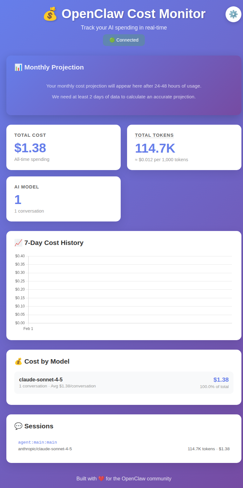
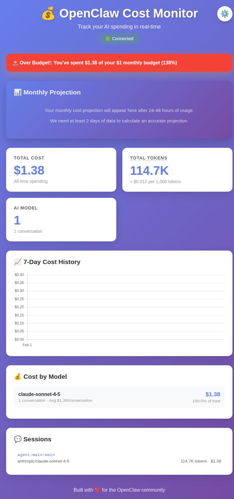

# 💰 OpenClaw Cost Monitor

**Track your OpenClaw (formerly Clawdbot) AI spending in real-time. Never get surprised by API bills again.**

Unlike Claude's platform dashboard which only shows overall API usage, this gives you OpenClaw-specific insights with historical tracking and budget projections.





## The Problem

OpenClaw/Clawdbot users have no idea what they're spending:
- "I've been using this for 2 days, spent $300+ on what felt like basic tasks" (Hacker News)
- "Is this going to cost me $10 or $150 this month?"
- Claude's dashboard shows API usage, but not OpenClaw-specific costs
- No way to predict monthly spending

## The Solution

A beautiful real-time dashboard with advanced analytics:

**📊 Real-Time Tracking:**
- ✅ Live cost updates (refreshes every 5 seconds)
- ✅ Total cost across all sessions
- ✅ Token usage breakdown (input/output)
- ✅ Cost by model (Claude, GPT, etc.)
- ✅ Per-session details

**📈 Historical Analytics:**
- ✅ 7-day cost history with charts
- ✅ Daily spending trends
- ✅ Visual graphs powered by Chart.js

**🎯 Budget Projections:**
- ✅ Monthly cost projection based on usage
- ✅ Daily burn rate calculation
- ✅ Budget alerts when exceeding $50/month
- ✅ "At this rate, you'll spend $X this month"

**🔄 Works Everywhere:**
- ✅ All AI providers (Anthropic, OpenAI, etc.)
- ✅ Multiple OpenClaw sessions
- ✅ Claude Pro users tracking API overflow
- ✅ Works with both OpenClaw and legacy Clawdbot installs

## Quick Start

```bash
# Install dependencies
cd openclaw-cost-monitor
npm install

# Start the dashboard
npm start

# Open in your browser
# http://localhost:3939
```

## How It Works

1. Reads your OpenClaw session data from `~/.clawdbot/agents/main/sessions/sessions.json`
2. Calculates costs based on official model pricing **including prompt caching discounts**
3. Displays everything in a clean, real-time dashboard
4. Updates automatically as you use OpenClaw

**Note:** Works with both OpenClaw and legacy Clawdbot installations - the session file format is the same.

## Why Your Costs Are Lower Than Expected 💚

**Good news:** OpenClaw/Clawdbot uses **Prompt Caching**, which dramatically reduces costs!

### What is Prompt Caching?

Every time you chat with AI, it needs your full conversation history. Without caching, you'd pay full price for resending that entire history every turn.

With **Prompt Caching** (Anthropic Claude feature):
- Repeated context is stored and reused
- **90% discount** on cached tokens ($0.30/M instead of $3.00/M)
- Makes long conversations 5-10x cheaper

### Real Example:

**Typical chat turn:**
- New input: 100 tokens × $3.00/M = **$0.0003**
- Chat history (cached): 27,000 tokens × $0.30/M = **$0.0081** 
- AI response: 500 tokens × $15.00/M = **$0.0075**
- **Total: $0.0159** (~1.6 cents per message)

**Without caching, that same turn would cost $0.0909** (9 cents) — over 5x more!

### How the Dashboard Shows This

The cost monitor now displays:
- **Green savings card** showing how much caching saved you
- **Token breakdown** (input / output / cached)
- **Real costs** based on the actual pricing including cache discounts

If you were using the old version (v0.2.x or earlier), costs were **overestimated by 10x** because caching wasn't accounted for. The fixed version (v0.3.0+) shows accurate costs.

## Supported Models

- Claude Sonnet 4/4.5
- Claude Opus 4
- GPT-4/GPT-4 Turbo
- GPT-3.5 Turbo
- And more...

## Requirements

- Node.js 14+
- An active OpenClaw (or Clawdbot) installation

## What's Next?

**v0.3 (Future):**
- Export to CSV
- Email/Telegram alerts
- Configurable budget limits (currently $50)
- Multi-agent comparison
- Cost optimization suggestions
- Historical data beyond 30 days

## Pricing

**Currently:** Free and open source

**Future:** Optional $5/month for cloud-hosted version with historical data

## Built By

[@0xboko](https://x.com/0xboko) at [Blockstrata](https://blockstrata.co)

Built with ❤️ for the OpenClaw community.

## License

MIT
